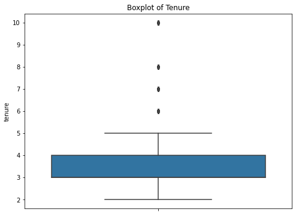
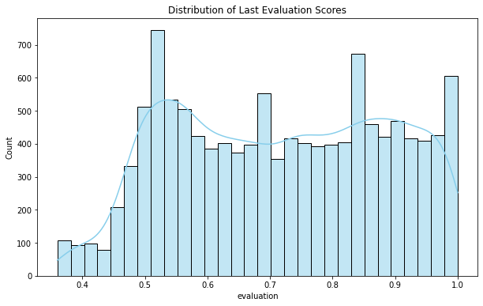
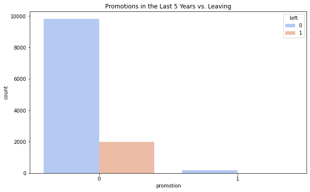

# Salifort Motors Project Showcase

## Introduction

Welcome to the Salifort Motors Project Showcase! This project is a comprehensive analysis aimed at understanding and improving employee retention at Salifort Motors. The webpage provides an in-depth look into the data analysis, modeling processes, and key findings.

## Table of Contents
- [Overview](#overview)
- [Exploration](#exploration)
- [Analysis](#analysis)
- [Conclusion and Recommendations](#conclusion-and-recommendations)
- [About the Project](#about-the-project)

## Overview

The `index.html` file is designed to provide an engaging and accessible presentation of the Salifort Motors employee retention project. It includes several sections, each providing detailed insights and visualizations.

### Key Features:
- **Visual Design and Aesthetics**: The webpage uses a cohesive color scheme, consistent typography, and subtle animations to enhance user interaction and readability.
- **Navigation and Usability**: A sticky navbar ensures easy navigation, while collapsible sections make the content less overwhelming.
- **User Engagement and Accessibility**: Enhanced tooltips, callouts, and smooth transitions improve the overall user experience.
- **Content Presentation**: Simplified technical jargon and clear examples make the content accessible to both technical and non-technical audiences.

## Exploration

### Data Introduction
The dataset provided by the HR department contains 15,000 rows and 10 columns, including:
- **satisfaction_level**: Employee-reported job satisfaction level (0–1)
- **last_evaluation**: Score of employee’s last performance review (0–1)
- **number_project**: Number of projects employee contributes to
- **average_monthly_hours**: Average number of hours worked per month
- **time_spend_company**: Years spent at the company
- **Work_accident**: Whether the employee experienced a work accident
- **left**: Whether the employee left the company
- **promotion_last_5years**: Whether the employee was promoted in the last 5 years
- **Department**: Employee’s department
- **salary**: Employee’s salary (low, medium, high)

### Data Preparation and Cleaning
The data preparation stage involved cleaning the dataset and encoding categorical variables using one-hot encoding to ensure it was ready for analysis and modeling.

### Descriptive Statistics
- Average satisfaction level: 0.61
- Average last evaluation score: 0.72
- Average number of projects: 3.5
- Average monthly hours: 201
- Median tenure: 3 years
- Percentage of employees who left: 23.8%
- Percentage of employees who had work accidents: 14.5%
- Percentage of employees who were promoted in the last 5 years: 2.63%

### Visualizations
1. **Boxplot of Tenure**: Shows the distribution of employee tenure.
   
2. **Correlation Heatmap**: Displays correlation between various factors.
   
3. **Employees Leaving by Department**: Shows the distribution of employees leaving by department.
   
4. **Employees Leaving by Salary Level**: Illustrates the distribution of employees leaving by salary level.
   
5. **Distribution of Satisfaction Levels**: Displays the distribution of employee satisfaction levels.
   
6. **Distribution of Last Evaluation Scores**: Shows the distribution of employee last evaluation scores.
   
7. **Number of Projects Undertaken by Employees**: Illustrates the number of projects employees are involved in.
   
8. **Distribution of Average Monthly Hours**: Displays the distribution of average monthly hours worked by employees.
   
9. **Number of Years Employees Have Spent with the Company**: Shows the number of years employees have spent with the company.
   
10. **Promotions in the Last 5 Years vs. Leaving**: Illustrates the relationship between promotions and leaving.
    

## Analysis

### PACE Framework
The project follows the PACE framework: Plan, Analyze, Construct, and Execute.
- **Plan Stage**: Understanding the business scenario and problem.
- **Analyze Stage**: Conducting an in-depth exploratory data analysis (EDA).
- **Construct Stage**: Building predictive models to forecast employee turnover.
- **Execute Stage**: Interpreting the model results and making actionable recommendations.

### Model Evaluation
- **Logistic Regression**:
  - Accuracy: 78%
  - Precision: 73%
  - Recall: 69%
  - F1-Score: 71%
- **Random Forest**:
  - Accuracy: 84%
  - Precision: 80%
  - Recall: 78%
  - F1-Score: 79%
- **XGBoost**:
  - Accuracy: 86%
  - Precision: 82%
  - Recall: 80%
  - F1-Score: 81%

### Feature Importance Analysis
Using models like Random Forest and XGBoost, the most influential features were identified as satisfaction level, number of projects, and last evaluation scores.

### Cross-Validation
K-fold cross-validation was employed to ensure the model's performance is reliable.

## Conclusion and Recommendations

### Key Findings
- Employee satisfaction, workload, tenure, and evaluation scores are critical in predicting turnover.
- Departments with higher turnover rates need targeted interventions.

### Recommendations
- Focus on improving employee satisfaction.
- Monitor employees with specific tenure or those working on many projects.
- Consider employee retention programs or initiatives.
- Periodically survey employee satisfaction to intervene if a decline is noted.

### Next Steps
- Further analyze what causes employee dissatisfaction.
- Explore if providing additional perks or benefits can reduce churn.

## About the Project

This project represents a thorough analysis of employee retention factors at Salifort Motors. It combines data science techniques with practical business insights to provide actionable recommendations for the HR department. For those interested, the complete code and analysis can be found in the accompanying [Python code](https://github.com/tzolkowski96/tzolkowski96/tree/main/Employee-Churn-Prediction).

**Note**: This project was part of the Google Advanced Data Analytics Capstone course on Coursera. The dataset used in this project is credited to the course.

## License
&copy; 2024 Tobin Zolkowski. All rights reserved.

[GitHub Repository](https://github.com/tzolkowski96/Salifort-Motors-Project)
